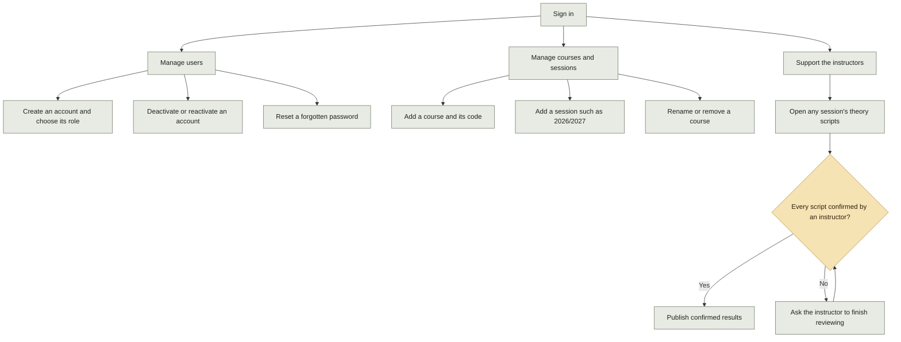

# NACOLM CBT: instructor and admin flows

How instructors and admins use the portal, from course setup to published results, including pen-and-paper theory marking. The AI only proposes a score. The instructor confirms every mark before it counts.

The same diagrams are in [instructor-admin-flow.drawio](instructor-admin-flow.drawio) (open in draw.io; three pages: instructor, admin, roles).

Key: **grey** = step done in the portal, **amber** = human decision, **blue** = automatic (local models), **purple** = handed to another role.

## Instructor: from question bank to confirmed results

```mermaid
flowchart TD
  A["Sign in"] --> B["Open the course session"]
  B --> C["Upload past papers and study material"]
  C --> D["Questions extracted from past papers"]
  D --> E["Set the blueprint: counts, topics, difficulty, release time"]
  E --> F["Build the question set: bank questions plus AI drafts"]
  F --> G{"Review each question"}
  G -->|Approve or edit| G2["Theory: write a model answer; AI drafts key points, variations and sample answers"]
  G2 --> G3{"Test the scheme on the samples, then approve it"}
  G3 --> H["Check topic coverage"]
  G -->|Reject| F
  H --> I["Add candidates and issue PINs"]
  I --> J["Exam officer or admin publishes the paper and builds the package"]
  J --> K["Exam runs at the venue; objective questions marked automatically"]
  K --> L["Theory answers written on QR-coded answer sheets"]
  L --> M["Scan all pages and upload them in one go; each page is filed by its code"]
  M --> N["Local vision model reads the handwriting"]
  N --> O["Local marker proposes a score with a reason"]
  O --> P{"Compare the scan with what was read"}
  P -->|Accept or change the score| Q["Confirm the mark"]
  P -->|Reading looks wrong| M
  Q --> R{"All scripts confirmed?"}
  R -->|No| P
  R -->|Yes| S["Publish confirmed results"]
  S --> T["Published marks are locked; corrections are recorded with a reason"]
  T --> U["Exam officer imports the venue's signed results file: objective plus theory = final result"]

  classDef step fill:#e8ebe4,stroke:#6b7563,color:#1d2318
  classDef human fill:#f6e3b4,stroke:#a9873a,color:#2b2110
  classDef auto fill:#d5e3ef,stroke:#5d86a8,color:#14212e
  classDef hand fill:#e6d9ee,stroke:#8a6a9c,color:#25182d
  class A,B,C,E,F,H,I,K,L,M,Q,S,T,U step
  class G,G3,P,R human
  class D,G2,N,O auto
  class J hand
```

- **The AI never decides.** The proposed score (qwen3:4b) is pre-filled, but the instructor's confirmed score is the one recorded. Re-running the AI clears any earlier confirmation. A slower second opinion from deepseek-r1 is one click away.
- **Bulk marking runs in the background.** Every waiting script is read first, then all are marked, so each model loads once. On the current server that is about 3 minutes per answer; the page shows how many are waiting and roughly when it will finish.
- **Approved schemes only.** A theory question can't go on a published paper until an instructor has approved its marking scheme; publishing freezes that scheme with the paper. The AI marks against it point by point, and a mark that differs from the AI's needs a reason.
- **QR-coded answer sheets.** Print them from the Theory scripts page: one sheet per candidate, question and page, each with a code. Upload the scanned pages in any order; pages of the same answer are kept together and turned upright. Pages without a readable code wait in a list for a person to file.
- **Answers are treated as data.** Text in a scan that tries to instruct the marker is ignored, and the review screen shows a warning on the justification.

## Admin: setting the system up and keeping it running

- **Admins set up, instructors run exams.** Only admins can create accounts and courses. Publishing a paper, setting its exam date and building the exam package are done by the exam officer or an admin; the published version records who did it.
- **Results follow the same rule.** An admin can publish results, but only once every script has been confirmed by a person.

## Who can do what

| Action | Instructor | Exam officer | Admin |
|---|---|---|---|
| Upload documents, set blueprint, review questions | Yes | Yes | Yes |
| Add candidates and reset PINs | Yes | Yes | Yes |
| Upload scans, review and confirm theory marks | Yes | Yes | Yes |
| Publish confirmed theory results | Yes | Yes | Yes |
| Publish the exam paper and build the package | No | Yes | Yes |
| Create courses and sessions | No | No | Yes |
| Create and manage user accounts | No | No | Yes |
